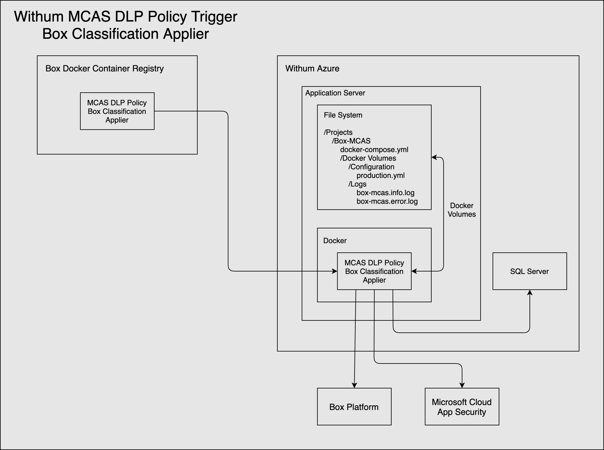
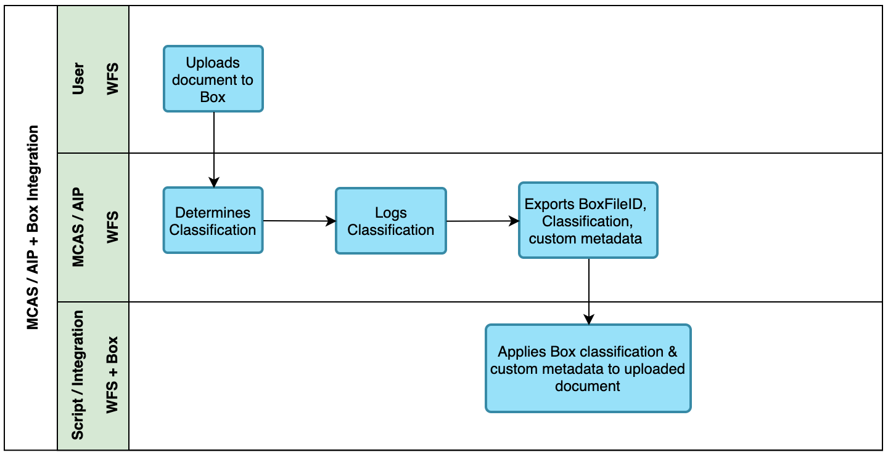

## MCAS DLP Policy Box Classification Applier 
### Architecture
  
 
### Features   
### Runtime Requirements  
[Python 3.6+](https://www.python.org/downloads/)  
[pip package manager](https://pip.pypa.io/en/stable/installing/)  
[virtualenv](https://virtualenv.pypa.io/en/latest/)  
[Docker](https://www.docker.com/)  
### Set up and Run  
1. From the project root folder, create a Python 3.6+ virtual environment  
`$ virtualenv --python=python3 env`  
2. Activate the virtual environment  
`$ source env/bin/activate`  
3. Install the project dependencies  
`$ pip install -r requirements.txt`  
4. Run the command line interface menu to see the available commands  
`$ python src/cli/main.py mcas-policy-box-classification_sync` 
### Set up and Run with Docker  
1. Run the development images  
`$ make dev`  
2. Run the production images  
`$ make prod`
### Pull the Image from DockerHub Image Registry
1. Login to DockerHub
`$ docker login --username=boxdave`  
`$ [ENTER YOUR PASSWORD]`  
2. Pull the image  
`$ docker pull boxdave/mcas-dlp-policy-box-classification-applier:latest`  